# OGPlayer — React Native demo app

Integration demos for the [OGPlayer](https://ogplayer.tv) React Native
SDK: VOD, live & DVR, low-latency live (LL-HLS, a few seconds behind
real time), DRM with a JavaScript token provider, Google IMA ads,
playlists with an "Up next" card, a swipeable vertical video feed,
subtitles & multi-audio, casting, content ratings, watermark overlays,
custom controls, themed chrome (your brand's colour and size tokens),
localised chrome (every control label, menu row and message from one
strings map) and error handling — each demo is a small, readable screen
you can lift code from.

## Screenshots

Android:

<p>
  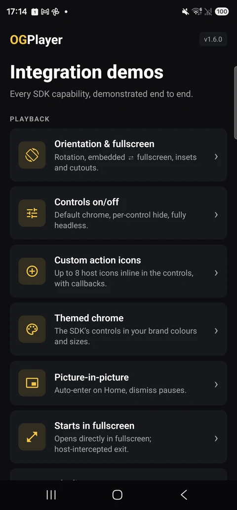
  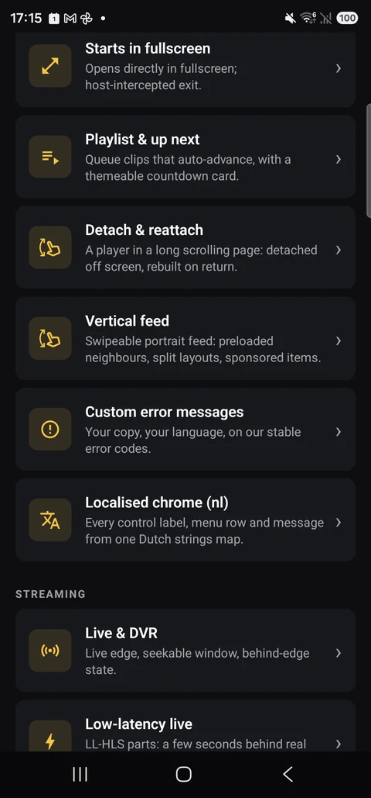
  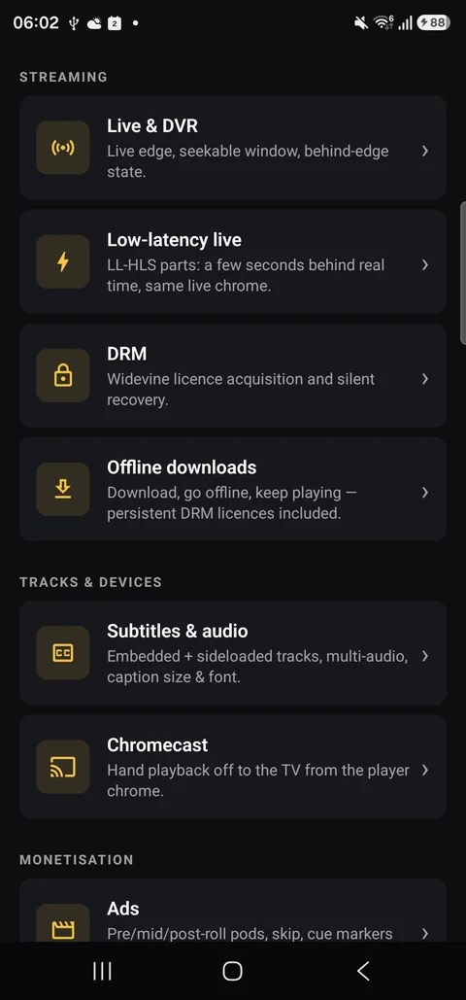
  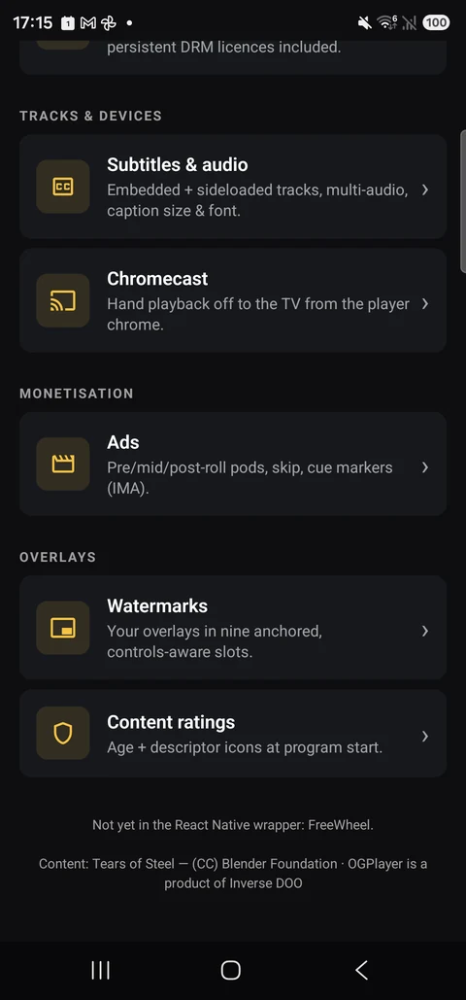
</p>
<p>
  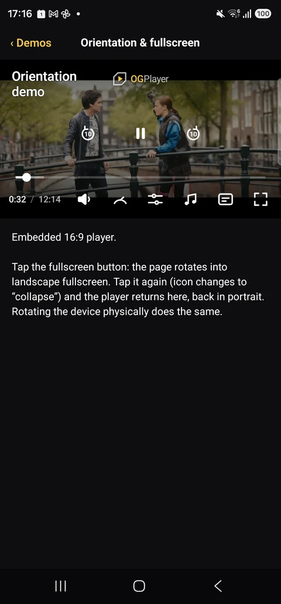
  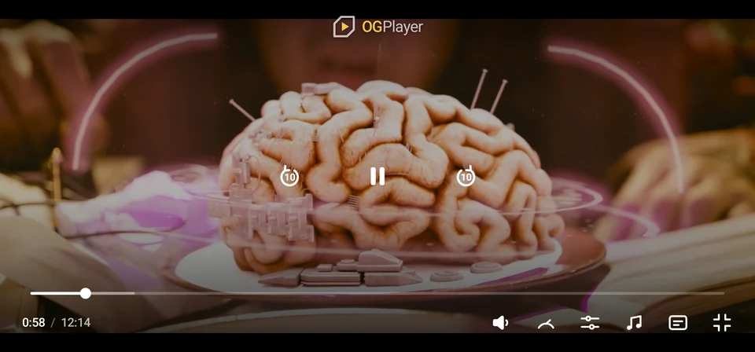
</p>

iOS:

<p>
  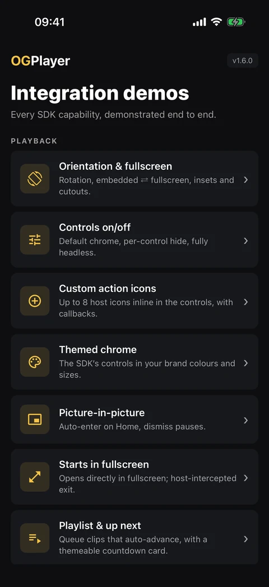
  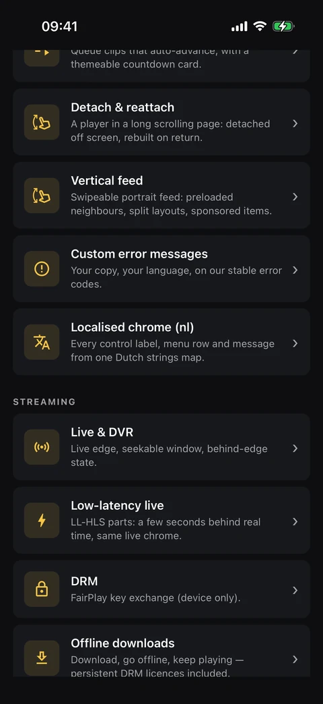
  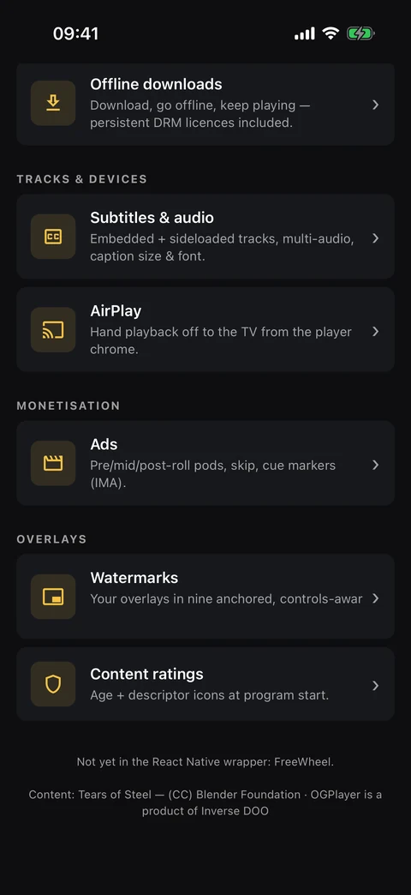
</p>
<p>
  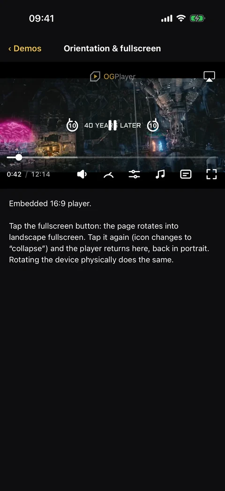
  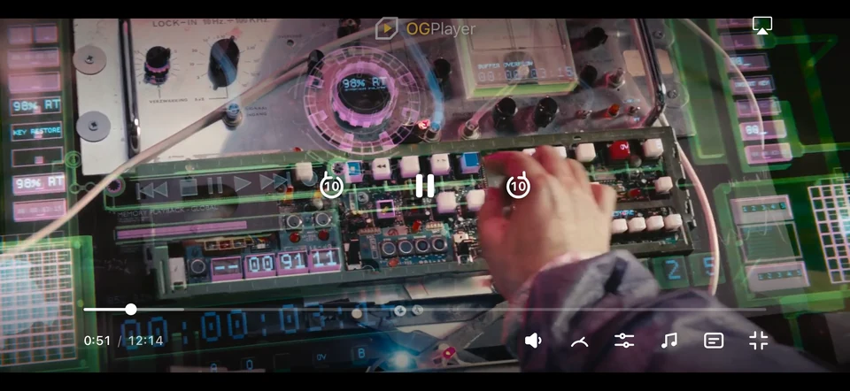
</p>

## Run it

```bash
npm install
npm start                    # Metro

# Android — device or emulator
npm run android

# iOS — pod install fetches the OGPlayer frameworks automatically
cd ios && pod install && cd ..
npm run ios
```

Requires Node 22.11+. The SDK resolves from npm:

```bash
npm install ogplayer-react-native
```

## Integrating in your own app

The demos already carry the three platform requirements your app will
need too:

- **Android** — minSdk 26, core-library desugaring (the playback engine
  requires it), and — only if you enable casting — the
  `OGCastOptionsProvider` meta-data entry in `AndroidManifest.xml`.
- **iOS** — iOS 18+. For fullscreen rotation, the app declares landscape
  orientations in `Info.plist` and forwards
  `supportedInterfaceOrientationsFor` to the SDK in `AppDelegate` (see
  `ios/OGPlayerDemos/AppDelegate.swift`).
- The vertical feed is a portrait surface: it keeps the screen portrait
  while on screen.

Docs: https://ogplayer.tv/docs · Live web demo: https://demo.ogplayer.tv

## Notes

- **FreeWheel** ads are not yet available in the React Native SDK — use
  the native Android/iOS SDKs if you need FreeWheel today.
- **Licensing:** this demo code is MIT. The OGPlayer SDK itself is a
  commercial product — free to evaluate with a watermark; production use
  requires a license. See https://ogplayer.tv/terms/
- **Read-only repository:** issues and pull requests are closed —
  questions and reports are welcome at hello@ogplayer.tv.

Demo content: Tears of Steel — (CC) Blender Foundation · mango.blender.org
